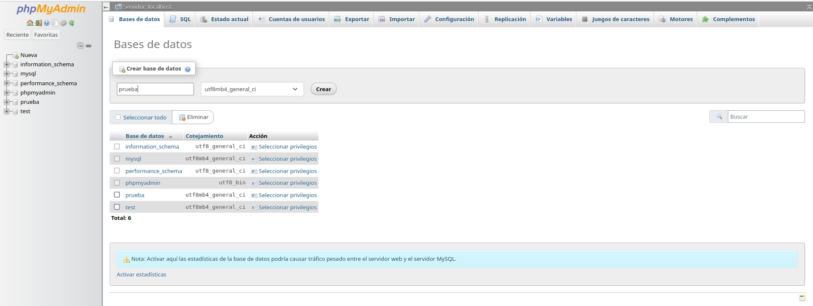
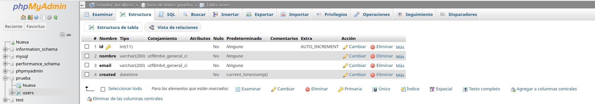

# Crear base de datos, crear tablas, conexión a la base de datos
## Moisés Alejandro Luis Herrera
---

#### 1. Crear la base de datos en **phpMyAdmin**:

Primero, abrimos **phpMyAdmin** en nuestro navegador (`http://localhost/phpmyadmin`). En la interfaz de phpMyAdmin, seguimos los siguientes pasos:

1. Nos dirigimos al menú de la izquierda y buscamos la opción **Nueva** o **Database**.
2. En el campo que aparece, ingresamos el nombre que queremos darle a nuestra base de datos, en nuestro caso, `prueba`.
3. Seleccionamos el cotejamiento (charset) adecuado, generalmente `utf8_general_ci`, que permite caracteres especiales como tildes y ñ.
4. Presionamos el botón **Crear** y phpMyAdmin generará la nueva base de datos.

#### 2. Crear una tabla en la base de datos:

Después de crear la base de datos, vamos a agregar una tabla.

1. En el menú de la izquierda, seleccionamos la base de datos que acabamos de crear(`prueba`)
2. Hacemos clic en la pestaña **Tablas** y luego en **Crear tabla**.
3. Especificamos un nombre para la tabla, como por ejemplo `users`.
4. Establecemos el número de campos (columnas) que tendrá la tabla. Necesitamos 4 columnas.
5. Luego, llenamos los detalles de cada campo:
   - **id** (INT, AI: Auto Increment, Primary Key)
   - **nombre** (VARCHAR, longitud 200)
   - **email** (VARCHAR, longitud 200)
   - **created_at** (DATETIME, current_timestamp())
6. Una vez completado, hacemos clic en **Guardar** para crear la tabla.


#### 3. Conectar a la base de datos con **PHP** usando **mysqli**:

Después de crear nuestra base de datos y tabla, procedemos a realizar la conexión con PHP usando la extensión **mysqli**. Creamos un archivo PHP (por ejemplo, `conexion.php`) y seguimos estos pasos:

1. Definimos los parámetros de conexión:
   ```php
   <?php
   $servidor = "localhost";  // Nuestro servidor
   $usuario = "root";
   $password = "";
   $base_datos = "prueba"; // El nombre de la base de datos que hemos creado

   // Crear la conexión
   $conexion = new mysqli($servidor, $usuario, $password, $base_datos);

   // Verificamos si la conexión es exitosa
   if ($conexion->connect_error) {
       die("Error en la conexión: " . $conexion->connect_error);
   }
   echo "Conexión exitosa";
   ?>
   ```

2. Guardamos el archivo y lo ejecutamos en nuestro servidor local **XAMPP**.

Si todo está bien, deberíamos ver el mensaje "Conexión exitosa" al abrir el archivo `conexion.php` en el navegador.

#### 4. Manipulación de datos:

Una vez establecida la conexión, podemos realizar consultas como insertar datos, obtener información, actualizar o eliminar registros de la base de datos usando las funciones de `mysqli`. Ejemplo de inserción de datos:

```php
<?php
// Código de conexión (reutilizamos la conexión creada anteriormente)

$sql = "INSERT INTO prueba (nombre, email) VALUES ('el alfa', 'elalfa@gmail.com')";

if (mysqli_query($conexion, $sql)) {
    echo "Nuevo registro insertado correctamente";
} else {
    echo "Error: " . $sql . "<br>" . $conexion->error;
}

// Cerramos la conexión
$conexion->close();
?>
```

Con este procedimiento, podemos crear bases de datos, tablas y realizar operaciones básicas en **phpMyAdmin**, y también conectarnos a la base de datos con **PHP** usando **mysqli**.